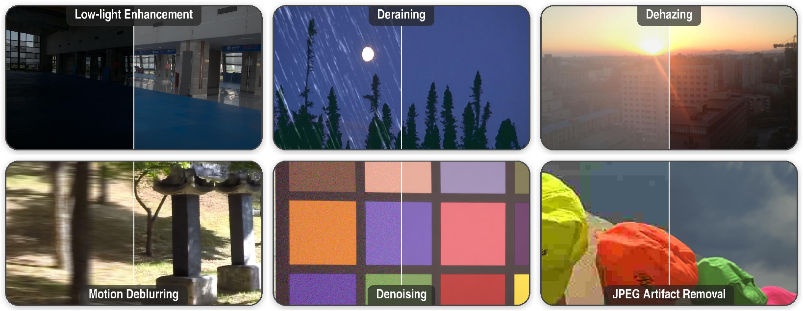

<div align="center">

# ImIR: Image-Instruction Tuning for All-in-One Image Restoration

**ACCV 2026**

Süleyman Aslan · Görkay Aydemir · Mısra Yavuz · Yunus Bilge Kurt<br>
Nasrin Rahimi · Ahmet Rasim Emirdağı · Burak Can Biner · M. Akın Yılmaz

**Codeway AI Research**

Project page: TODO · arXiv: TODO · Model weights: TODO · Proceedings: TODO

</div>



**One adapter, six tasks, no prompt.** The output of task-agnostic ImIR is produced
from the input image alone, with no text prompt and no degradation label. This
repository provides the command-line interface and Python API for ImIR inference.

## Installation

Use Python 3.10 or newer and a CUDA-capable NVIDIA GPU. Run the following commands
from the repository root:

```bash
python -m venv .venv
source .venv/bin/activate
python -m pip install --upgrade pip
```

Install a CUDA-enabled PyTorch build using the
[PyTorch installation selector](https://pytorch.org/get-started/locally/), then
install ImIR:

```bash
python -m pip install -e .
python -c "import torch; print('CUDA available:', torch.cuda.is_available())"
```

Use `--cpu-offload` to move model components between system RAM and the GPU when
GPU memory is limited. CPU offloading requires CUDA and sufficient system RAM.

## Checkpoint

Pass a local checkpoint directory or a Hugging Face model repository ID to
`--checkpoint`. A local checkpoint has the following files:

```text
checkpoints/imir/
├── imir_config.json
├── mapper.safetensors
└── pytorch_lora_weights.safetensors
```

The configuration is loaded automatically from the checkpoint. It specifies the
mapper architecture, backbone revision, resize policy, sampling steps, and
instruction scale; no separate configuration file is needed.

The Qwen-Image-Edit-2511 backbone is downloaded automatically at the revision
specified in `imir_config.json` and reused from the Hugging Face cache.

## Quick start

Restore the included [Rain100L sample](examples/deraining.png):

```bash
imir --checkpoint ./checkpoints/imir \
  --input examples/deraining.png \
  --output outputs/deraining.png \
  --cpu-offload \
  --seed 0
```

This creates the restored PNG and `outputs/deraining.json`, which records the
checkpoint, image sizes, seed, sampling steps, and instruction scale. The output
is returned at the original input resolution by default.

Sample attribution is provided in [examples/README.md](examples/README.md).

## Usage

### Restore a folder

```bash
imir --checkpoint ./checkpoints/imir \
  --input ./images \
  --output ./outputs \
  --recursive \
  --cpu-offload
```

Images are processed sequentially. Subdirectories and original filename
extensions are preserved, so `images/scene.jpg` produces
`outputs/scene.jpg.png`. Each image uses the same independent seed.
Add `--overwrite` to replace existing outputs.

### Adjust the instruction scale

```bash
imir --checkpoint ./checkpoints/imir \
  --input examples/deraining.png \
  --output outputs/deraining-scale.png \
  --scale 1.5 \
  --seed 0 \
  --cpu-offload
```

`--scale` multiplies the mapper's residual correction to the image instruction.
For low-light enhancement, varying it can produce different plausible exposures.
At scale 0, the editor uses the degraded image's embedding; diffusion still runs.
Sampling steps and scale default to the checkpoint's settings (30 steps and
scale 1 for the standard configuration).

### Python API

```python
from pathlib import Path
from imir import ImIRPipeline

pipe = ImIRPipeline.from_pretrained(
    "./checkpoints/imir",
    cpu_offload=True,
)
result = pipe("examples/deraining.png", seed=0)

Path("outputs").mkdir(exist_ok=True)
result.image.save("outputs/deraining.png")
print(result.metadata)
```

Use `instruction_scale=1.5` or `num_inference_steps=30` when calling `pipe` to
override the checkpoint defaults. Reuse the pipeline for sequential requests.

### Offline inference

Download the ImIR checkpoint and its configured backbone revision beforehand,
then pass their local paths:

```bash
imir --checkpoint ./checkpoints/imir \
  --base-model-path /path/to/Qwen-Image-Edit-2511-snapshot \
  --local-files-only \
  --input examples/deraining.png \
  --output outputs/deraining.png \
  --cpu-offload
```

The local backbone snapshot must match the revision in `imir_config.json`.
For a checkpoint on Hugging Face, `--revision <commit-sha>` selects a specific
checkpoint revision.

### Options

| Option | Description |
| --- | --- |
| `--checkpoint` | Local checkpoint directory or Hugging Face model ID. |
| `--input` / `--output` | Input image and output PNG, or input and output folders. |
| `--seed` | Random seed; defaults to 0. |
| `--steps` | Override the checkpoint's sampling steps. |
| `--scale` | Override the instruction residual scale. |
| `--cpu-offload` | Stage model components between CPU and GPU. |
| `--recursive` | Include subdirectories in folder mode. |
| `--overwrite` | Replace existing outputs. |
| `--keep-generation-size` | Keep the generated canvas size instead of resizing back. |
| `--task` | Task name for a task-aware checkpoint; omit for task-agnostic ImIR. |

Run `imir --help` for all options.

Images are EXIF-oriented and converted to RGB. The checkpoint determines whether
inputs are only downscaled or resized toward a target pixel area. Canvas dimensions
are aligned to multiples of 16, with no automatic tiling or content cropping.

## Acknowledgments

ImIR uses [Qwen-Image-Edit](https://github.com/QwenLM/Qwen-Image) and
[Hugging Face Diffusers](https://github.com/huggingface/diffusers).
See [NOTICE](NOTICE) for dependency and image attribution.

## Citation

```bibtex
% TODO: Add the official BibTeX citation
% after publication details are available.
```
